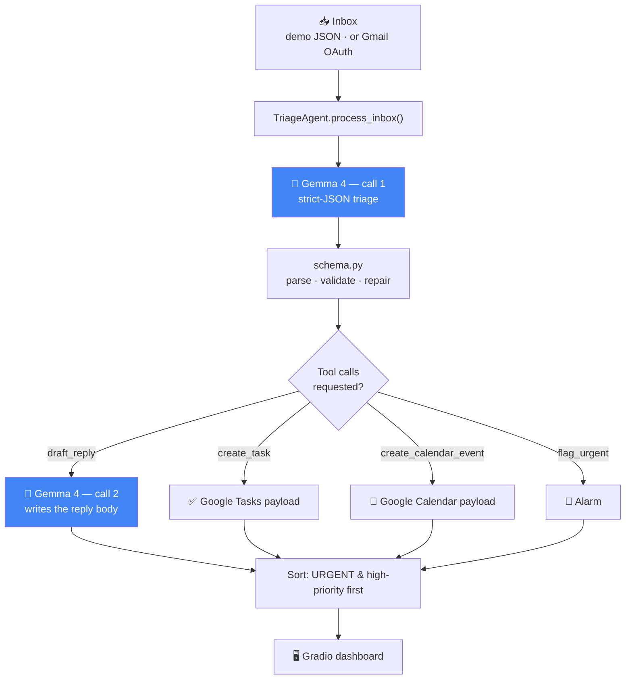

# 📥 Gemma-Triage — Smart Email Agent & Workflow Automator

**A privacy-first email agent that runs entirely on your device, powered by Gemma 4.**

Built for the **Build with Gemma** hackathon · Track: **Local Frontier Innovation**

Gemma-Triage reads an inbox and, for every message, does four things in one pass:

| | |
|---|---|
| 🏷️ **Classifies & prioritises** | `URGENT` / `ACTION_NEEDED` / `FYI` / `SPAM`, plus a 1–5 priority |
| 📝 **Summarises** | one sentence that states the *ask*, not the topic |
| ✍️ **Drafts a reply** | a ready-to-send body in a tone the model itself chose |
| ⚙️ **Extracts and executes** | follow-up tasks and calendar events, emitted as real tool calls |

Then it re-sorts the inbox so what actually matters is at the top.

> **The winning angle:** Gemma-Triage hits **two Gemma 4 pillars at once.**
> **Edge & Offline Intelligence** — the whole agent runs on-device on Gemma 4 E4B,
> so your email never leaves your machine. **Agentic Workflows** — native function
> calling turns reading email into *finished work*, not more reading.

---

## The problem

Email is where knowledge work goes to queue. The average professional gets ~120 messages a
day and spends around a quarter of the working week in the inbox — mostly re-reading things
to answer one question: *does this need me, and when?*

Every existing AI email assistant answers that question **in someone else's cloud**. That is
a hard blocker for exactly the people who need it most: clinicians, lawyers, therapists,
journalists protecting sources, HR and finance teams, anyone under GDPR/HIPAA. Their inbox is
the single most sensitive document they own, and shipping it to a third-party API is not a
trade-off they are allowed to make.

**Gemma-Triage removes the trade-off.** Gemma 4 E4B is small enough to run on a laptop and
capable enough to reason, produce strict structured output, and call tools. So the agent can
be genuinely useful *and* genuinely private — no API key, no network, no data exfiltration.

---

## Quickstart

```bash
git clone <YOUR_REPO_URL> gemma-triage
cd gemma-triage

python -m venv .venv && source .venv/bin/activate    # Windows: .venv\Scripts\activate
pip install -r requirements.txt

python app.py                                        # → http://localhost:7860
```

The app opens **straight into a working demo inbox** — no login, no token, no model
download. Press **⚡ Run Triage** and watch it work.

### Turning on real on-device Gemma 4

```bash
pip install -r requirements-local.txt   # torch + transformers + accelerate
export HF_TOKEN=hf_...                  # accept the Gemma licence on Hugging Face first
export GEMMA_BACKEND=transformers
export GEMMA_MODEL_ID=google/gemma-4-E4B-it     # or google/gemma-4-E2B-it if RAM is tight

python app.py
```

The status bar at the top of the app always tells you which engine is live.

---

## How Gemma 4 is used

Gemma 4 **is** the application. Strip it out and there is nothing left but a Gradio shell.

**1. Structured reasoning as the classifier.** There is no fine-tuned model, no scikit-learn
pipeline, no rules engine in the product path. `prompts/triage_prompt.txt` hands Gemma 4 a
category vocabulary, a priority rubric and a tool catalogue, and asks for **one strict JSON
object**. Gemma's output *is* the data structure the rest of the app runs on:

```json
{
  "category": "ACTION_NEEDED",
  "priority": 3,
  "summary": "Recruiter needs the 2026-08-11 10:30 technical interview slot confirmed.",
  "reasoning": "A direct request to the recipient with a concrete proposed time, but nothing is blocked today.",
  "suggested_reply": "Hi Tomas, that slot works — please send the video link.",
  "actions": [
    { "tool": "draft_reply",           "args": { "tone": "professional" } },
    { "tool": "create_task",           "args": { "title": "Confirm interview slot", "due": "tomorrow" } },
    { "tool": "create_calendar_event", "args": { "title": "Technical interview", "date": "2026-08-11", "time": "10:30" } }
  ]
}
```

**2. Native function calling as the action layer.** Gemma 4 chooses *which* of four tools to
call and *with what arguments* — `draft_reply`, `create_task`, `create_calendar_event`,
`flag_urgent`. `agent/tools.py` executes them for real: tasks and events come out as
validated payloads already shaped for the Google Tasks and Google Calendar REST APIs.

**3. Gemma calls itself.** `draft_reply` is not a template — it invokes **a second Gemma 4
generation** with `prompts/reply_prompt.txt` and the tone the model picked in step 1. That
makes this a genuine multi-step agent loop: *reason → select tool → invoke the model again in
service of that tool → return a result*.

**4. Long context, used deliberately.** Gemma 4's 128k window means a full thread — headers,
quoted history, forwarded chains — goes in whole. No chunking, no retrieval, no lost context.

**5. Edge-sized on purpose.** E4B is the point. A model this capable that fits on a laptop is
what makes "your email never leaves the device" an engineering fact rather than a promise.

---

## Architecture



<details>
<summary>Same diagram as plain ASCII</summary>

```
   Inbox (demo JSON | Gmail OAuth)
                 │
                 ▼
        TriageAgent.process_inbox()
                 │
                 ▼
   ┌──────────────────────────────┐
   │  GEMMA 4  — call 1           │  triage_prompt.txt
   │  strict-JSON triage decision │  →  {category, priority, summary,
   └──────────────────────────────┘      reasoning, suggested_reply, actions[]}
                 │
                 ▼
        schema.py · parse / validate / repair
                 │
                 ▼
        tools.py · execute_actions()
     ┌───────────┼────────────┬─────────────┐
     ▼           ▼            ▼             ▼
 draft_reply  create_task  create_event  flag_urgent
     │
     └─► GEMMA 4 — call 2 (reply_prompt.txt) writes the body
                 │
                 ▼
        sort: URGENT / high-priority first
                 │
                 ▼
          Gradio triage dashboard
```
</details>

### Repository layout

```
gemma-triage/
├── app.py                      # Gradio dashboard (HF Spaces app_file)
├── requirements.txt            # lean install — UI + hosted Gemma + Gmail
├── requirements-local.txt      # on-device stack: torch + transformers
├── agent/
│   ├── llm.py                  # GemmaLLM: transformers → hf_api → heuristic
│   ├── schema.py               # TriageDecision + tolerant JSON parsing
│   ├── triage.py               # TriageAgent: classify → execute → sort
│   └── tools.py                # the four tools + executor
├── prompts/
│   ├── triage_prompt.txt       # forces one strict JSON object
│   └── reply_prompt.txt        # writes the reply body
├── gmail_integration/
│   └── client.py               # OAuth, fetch_recent(), create_draft()
├── data/sample_inbox.json      # 12 synthetic emails, every category
└── tests/test_triage.py        # 39 tests, heuristic backend, no network
```

---

## The three-tier backend (and why it matters)

`GEMMA_BACKEND=auto` walks down this ladder until one works:

| Tier | What runs | Privacy | When it is used |
|---|---|---|---|
| `transformers` | **Gemma 4 locally** via `AutoProcessor` + `Gemma4ForConditionalGeneration` | 🟢 nothing leaves the device | `requirements-local.txt` installed and weights available |
| `hf_api` | **Gemma 4 hosted** via `InferenceClient` | 🟡 inference is remote | `HF_TOKEN` is set |
| `heuristic` | keyword engine, **no model** | 🟢 nothing leaves the device | nothing else is available |

The heuristic tier is not a mock — it emits the **same JSON contract**, so the schema
validation, the tool executor, the sorting and the UI are byte-for-byte the same code paths.
That is what makes the demo un-crashable: a judge with no GPU, no token and no network still
sees the complete agentic workflow, **clearly labelled** as the fallback in the status bar.

The model-class probe order (`Gemma4ForConditionalGeneration` →
`AutoModelForImageTextToText` → `AutoModelForCausalLM`) means the loader survives differences
between `transformers` releases.

**Other on-device runtimes** for deployment beyond this repo:
`unsloth/gemma-4-E4B-it-GGUF` for llama.cpp / quantised CPU inference, and
`litert-community/gemma-4-E4B-it-litert-lm` for LiteRT on mobile.

---

## Agentic workflow walkthrough

Email #5 in the demo inbox, from a recruiter:

> *"The proposed slot is 2026-08-11 at 10:30. Please confirm the slot works and I'll send the
> video link. If it doesn't, send me two alternative windows that week."*

1. **Gemma call 1** returns the JSON above: `ACTION_NEEDED`, priority 3, a one-line summary,
   and three tool calls.
2. **Validation** (`schema.py`) canonicalises the category, clamps the priority to 1–5, and
   drops any tool outside the allow-list.
3. **Execution** (`tools.py`):
   - `draft_reply` → **Gemma call 2** writes a professional-tone body, returned with
     `To:` and `Re:` already filled in.
   - `create_task` → `{"title": "Confirm interview slot", "due": "2026-08-04", ...}` plus an
     RFC 3339 `api_payload` ready for `tasks.tasks.insert`.
   - `create_calendar_event` → a 30-minute event with a full `events.insert` payload.
4. **Sorting** puts it above the FYI digest and below the production incident.
5. **The UI** shows the badge, the priority, the summary, Gemma's reasoning, the editable
   draft, and cards for the task and the event.

One email in. A verdict, a summary, a draft and two scheduled artefacts out.

### Guardrails

- **Never sends anything.** `gmail.compose` creates *drafts*. A human always presses send.
- **Never replies to spam.** Enforced in `schema.py`, not just asked for in the prompt.
- **Never invents dates.** An unresolvable phrase is preserved verbatim with a `null` ISO
  date rather than guessed at.
- **Never crashes on one bad email.** Every tool call is individually wrapped; a failure
  becomes a visible error card and the run continues.

---

## Configuration

All optional — see `.env.example`. With nothing set, the app runs the demo inbox on the
heuristic engine.

| Variable | Default | Purpose |
|---|---|---|
| `GEMMA_BACKEND` | `auto` | `auto` · `transformers` · `hf_api` · `heuristic` |
| `GEMMA_MODEL_ID` | `google/gemma-4-E4B-it` | any Gemma 4 checkpoint |
| `GEMMA_DEVICE` | `auto` | `auto` · `cpu` · `cuda` · `mps` |
| `HF_TOKEN` | — | gated weight download + the `hf_api` backend |
| `GOOGLE_CREDENTIALS_FILE` | `credentials.json` | OAuth client JSON |
| `GOOGLE_TOKEN_FILE` | `token.json` | cached user token (gitignored) |
| `GOOGLE_CALENDAR_TIMEZONE` | `UTC` | IANA zone stamped on calendar payloads |

You can also switch backend and model **live in the UI**, under *⚙️ Engine settings*.

### Gmail setup (optional)

1. Google Cloud Console → enable the **Gmail API**.
2. **Credentials → Create OAuth client ID → Desktop app** → download the JSON as
   `credentials.json` in the repo root.
3. Add your address as a **test user** on the OAuth consent screen.
4. Run locally, pick **Connect Gmail**, press **🔗 Connect & fetch**.

Scopes are minimal and read-mostly: `gmail.readonly` + `gmail.compose`. No send scope is
ever requested. `credentials.json` and `token.json` are both gitignored.

> The Gmail path is **local-only** — it needs a browser for the OAuth loopback, so it does
> not work on the hosted Space. That is deliberate: judges never have to log in.

---

## Deploy to Hugging Face Spaces

```bash
pip install huggingface_hub
huggingface-cli login

huggingface-cli repo create gemma-triage --type space --space_sdk gradio
git remote add space https://huggingface.co/spaces/<YOUR_USERNAME>/gemma-triage
git push space main
```

The YAML header at the top of this README **is** the Space configuration
(`app_file: app.py`, `sdk: gradio`). Nothing else is required — the Space boots into the demo
inbox on the heuristic engine with zero secrets.

**To run real Gemma 4 on the Space:**

- *Hosted inference (any free CPU Space)* — add `HF_TOKEN` under
  **Settings → Variables and secrets → New secret**, then set the variable
  `GEMMA_BACKEND=hf_api`.
- *True on-device inference* — upgrade to a **GPU Space** (T4 or better), rename
  `requirements-local.txt` to `requirements.txt`, and set `GEMMA_BACKEND=transformers`.

> If the Space build rejects `sdk_version: 6.20.0`, set it to any Gradio version Spaces
> offers — `app.py` feature-detects the Gradio API and runs unchanged on 4.x, 5.x and 6.x.

---

## Tests

```bash
python -m pytest tests/ -v      # or: python tests/test_triage.py
```

39 tests, no network, no weights, under a second. They pin the contract that matters:

- every email produces a schema-valid decision — category in vocabulary, priority in 1–5,
  non-empty summary, only allow-listed tools;
- the JSON parser survives markdown fences, surrounding prose, trailing commas, braces inside
  strings, and total garbage;
- category aliases normalise (`"action needed"` → `ACTION_NEEDED`), priorities clamp;
- spam never gets a drafted reply, urgent never sinks;
- date phrases resolve correctly (`"Friday"`, `"next Monday"`, `"in 3 days"`, `"Aug 20"`) and
  unrecognised phrases are preserved rather than invented;
- a failing tool call is reported and the **remaining tools still execute**;
- empty, malformed and null-field emails do not crash the agent;
- the sorted inbox really is URGENT-first.

---

## Screenshots

> Replace these placeholders with real captures before submitting.
> `docs/` is already present for them.

| | |
|---|---|
| **Dashboard after a run** — status bar, stat tiles, sorted results | `` |
| **Expanded email** — reasoning, editable draft, task & event cards | `` |
| **Raw agent trace** — the JSON Gemma actually produced | `` |

**Live demo:** `<YOUR_HUGGING_FACE_SPACE_URL>`
**Repository:** `<YOUR_REPO_URL>`

---

## Privacy & safety

- With the `transformers` backend, **no email content leaves the machine** — no telemetry, no
  API calls, no logging of message bodies.
- The app states its active backend in the status bar at all times. If it is running remotely
  or on the fallback engine, it says so.
- Drafts, tasks and events are **suggestions for a human to review**. Nothing is sent,
  scheduled or filed automatically.
- Secrets are never committed: `.env`, `credentials.json` and `token.json` are all gitignored
  and `.env.example` ships placeholders only.

---

## What's next

- Write extracted tasks and events straight into Google Tasks / Calendar via the payloads
  already generated.
- Thread-aware triage using the full 128k context — triage a conversation, not a message.
- Gemma 4's multimodality on attachments: screenshots, scanned invoices, photographed forms.
- A learned per-user priority profile, kept on-device.
- LiteRT / GGUF packaging for phones and offline laptops.

---

## Licence

Source code: **Apache-2.0** — see [LICENSE](LICENSE).

**Model weights are not covered by that licence.** Gemma models are distributed by Google
under the [Gemma Terms of Use](https://ai.google.dev/gemma/terms) and the
[Gemma Prohibited Use Policy](https://ai.google.dev/gemma/prohibited_use_policy), which you
accept when you download the weights. This project uses the **base Gemma 4
instruction-tuned checkpoints without fine-tuning**, so no derivative-model naming
requirements apply. If you fine-tune from this repo, follow Google's Gemma variant naming
guidance and note the change here.

All email content in `data/sample_inbox.json` is synthetic; every sender, domain and detail is
fictional.
